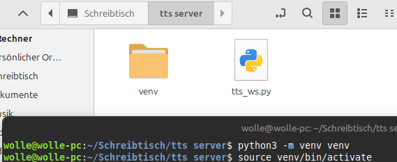
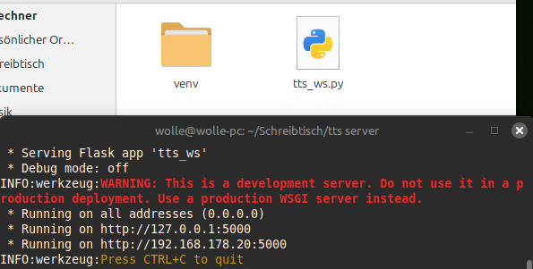
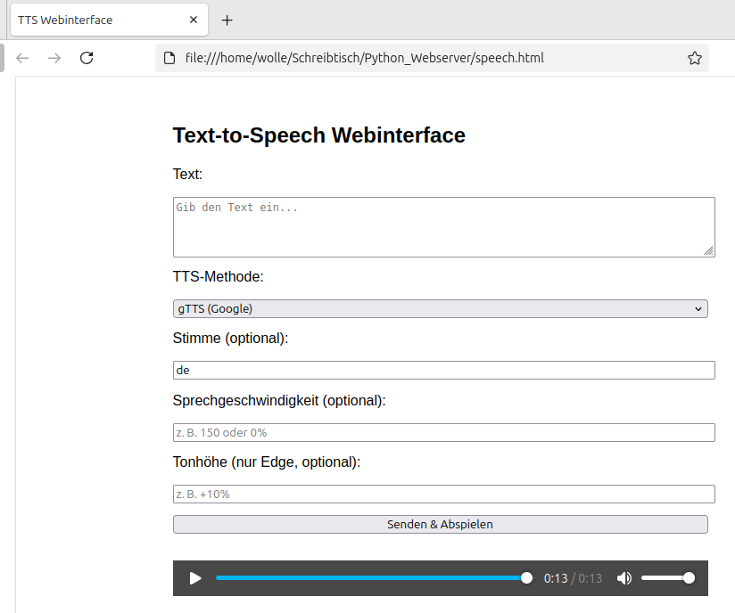

While many TTS servers require a subscription, or limit the number of words there is the possibility to operate your own TTS server in the home network.

[Nikhil-punia](https://github.com/Nikhil-punia) has written a function that can simply be added to this library. It works with a post Request, which allows much larger texts than fits in a GET header.
The advantages:
- Sending more amount of data for TTS
- Fast TTS
- Local TTS support

```c++
bool Audio::connect_local_tts(const String& host, int port, const String& path,
                             const String& text, const String& voice_id,
                              const String& lang, const String& endpoint) {

    if (text.isEmpty()) {
        AUDIO_INFO("TTS text is empty");
        stopSong();
        return false;
    }

    xSemaphoreTakeRecursive(mutex_playAudioData, 0.3 * configTICK_RATE_HZ);
    setDefaults();
    m_f_ssl = false;
    m_f_tts = true;
    m_speechtxt.assign(text.c_str());

    String body = "{";
    body += "\"text\":\"" + text + "\"";
    if (!voice_id.isEmpty()) body += ",\"voice\":\"" + voice_id + "\"";
    if (!lang.isEmpty()) body += ",\"lang\":\"" + lang + "\"";
    body += "}";

    String req = "POST " + path + " HTTP/1.1\r\n";
    req += "Host: " + host + "\r\n";
    req += "User-Agent: ESP32-AudioI2S\r\n";
    req += "Accept: */*\r\n";
    req += "Content-Type: application/json\r\n";
    req += "Content-Length: " + String(body.length()) + "\r\n";
    req += "Connection: close\r\n\r\n";
    req += body;

    _client = static_cast<WiFiClient*>(&client);
    AUDIO_INFO("Connecting to local TTS server %s:%d", host.c_str(), port);

    if (!_client->connect(host.c_str(), port)) {
        AUDIO_ERROR("Connection failed");
        xSemaphoreGiveRecursive(mutex_playAudioData);
        return false;
    }

    _client->print(req);

    m_f_running = true;
    m_dataMode = HTTP_RESPONSE_HEADER;
    m_lastHost.assign(host.c_str());

    if (endpoint == "gtts" || endpoint == "edge_tts") {
        m_expectedCodec = CODEC_MP3;
    } else if (endpoint == "tts") {
        m_expectedCodec = CODEC_WAV;
    }

    xSemaphoreGiveRecursive(mutex_playAudioData);
    return true;
}

```

And this can be used with a simple Python Server running locally :
```py
from flask import Flask, request, send_file, jsonify, after_this_request
from flask_cors import CORS
import pyttsx3
import uuid
import os
from gtts import gTTS
import asyncio
import edge_tts

app = Flask(__name__)
CORS(app)

# Load available pyttsx3 voices
engine = pyttsx3.init()
available_voices = {v.id: v.name for v in engine.getProperty('voices')}


@app.route('/voices', methods=['GET'])
def list_voices():
    """List available system voices (pyttsx3)."""
    return jsonify(available_voices)


@app.route('/tts', methods=['POST'])
def tts():
    """Offline TTS using pyttsx3."""
    data = request.get_json(force=True)
    text = data.get('text')
    voice_id = data.get('voice')
    rate = data.get('rate')

    if not text:
        return jsonify({"error": "Missing 'text' parameter"}), 400

    filename = f"/tmp/{uuid.uuid4().hex}.wav"

    try:
        engine = pyttsx3.init()
        if voice_id:
            engine.setProperty('voice', voice_id)
        if rate:
            engine.setProperty('rate', rate)
        engine.save_to_file(text, filename)
        engine.runAndWait()
    except Exception as e:
        return jsonify({"error": str(e)}), 500

    @after_this_request
    def remove_file(response):
        try:
            os.remove(filename)
        except Exception as e:
            app.logger.warning(f"Failed to delete file {filename}: {e}")
        return response

    return send_file(filename, mimetype='audio/wav')


@app.route('/gtts', methods=['POST'])
def gtts_endpoint():
    """Online TTS using Google gTTS."""
    data = request.get_json(force=True)
    text = data.get('text')
    lang = data.get('lang', 'en')

    if not text:
        return jsonify({"error": "Missing 'text' parameter"}), 400

    filename = f"/tmp/{uuid.uuid4().hex}.mp3"

    try:
        tts = gTTS(text=text, lang=lang)
        tts.save(filename)
    except Exception as e:
        return jsonify({"error": str(e)}), 500

    @after_this_request
    def remove_file(response):
        try:
            os.remove(filename)
        except Exception as e:
            app.logger.warning(f"Failed to delete file {filename}: {e}")
        return response

    return send_file(filename, mimetype='audio/mpeg')


@app.route('/edge_tts', methods=['POST'])
def edge_tts_route():
    """High-quality TTS using Microsoft Edge Neural voices (safe pitch/rate support)."""
    data = request.get_json(force=True)
    text = data.get('text')
    voice = data.get('voice', 'en-US-AriaNeural')
    rate = str(data.get('rate')) if 'rate' in data else None
    pitch = str(data.get('pitch')) if 'pitch' in data else None

    if not text:
        return jsonify({"error": "Missing 'text' parameter"}), 400

    filename = f"/tmp/{uuid.uuid4().hex}.mp3"

    async def generate_tts():
        options = {
            "text": text,
            "voice": voice
        }

        if rate and rate not in ["0%", "+0%", "-0%", "0", ""]:
            options["rate"] = rate
        if pitch and pitch not in ["0%", "+0%", "-0%", "0", ""]:
            options["pitch"] = pitch

        try:
            communicate = edge_tts.Communicate(**options)
            await communicate.save(filename)
        except Exception as e:
            if "pitch" in str(e).lower() or "rate" in str(e).lower():
                communicate = edge_tts.Communicate(text=text, voice=voice)
                await communicate.save(filename)
            else:
                raise e

    try:
        asyncio.run(generate_tts())
    except Exception as e:
        return jsonify({"error": str(e)}), 500

    return send_file(filename, mimetype='audio/mpeg')


if __name__ == '__main__':
    app.run(host='0.0.0.0', port=5000)

```
Installation instructions for the Python TTS Server:
Create an empty folder
Create an empty file in this folder and call it tts_ws.py
Add the python script into this file
Open a terminal in this folder
Create a new virtual environment
`python3 -m venv venv`
`source venv/bin/activate`
It looks like this:



then:
`pip install pyttsx3`
`pip install flask`
`pip install flask_cors`
`pip install gTTS`
`pip install edge_tts`
And then start the server:  `python3 tts_ws.py`



If necessary, adjust the firewall

A web interface for testing:
````html
<!DOCTYPE html>
<html lang="de">
<head>
    <meta charset="UTF-8">
    <title>TTS Webinterface</title>
    <style>
        body {
            font-family: Arial, sans-serif;
            max-width: 600px;
            margin: auto;
            padding: 2em;
        }
        label, select, input, textarea, button {
            display: block;
            width: 100%;
            margin-bottom: 1em;
        }
        audio {
            width: 100%;
            margin-top: 1em;
        }
    </style>
</head>
<body>
    <h2>Text-to-Speech Webinterface</h2>
    
    <label for="text">Text:</label>
    <textarea id="text" rows="4" placeholder="Gib den Text ein..."></textarea>

    <label for="method">TTS-Methode:</label>
    <select id="method">
        <option value="tts">pyttsx3 (offline)</option>
        <option value="gtts">gTTS (Google)</option>
        <option value="edge_tts">Edge TTS (Microsoft Neural)</option>
    </select>

    <label for="voice">Stimme (optional):</label>
    <input id="voice" placeholder="z. B. de-DE-KatjaNeural">

    <label for="rate">Sprechgeschwindigkeit (optional):</label>
    <input id="rate" placeholder="z. B. 150 oder 0%">

    <label for="pitch">Tonhöhe (nur Edge, optional):</label>
    <input id="pitch" placeholder="z. B. +10%">

    <button onclick="sendTTS()">Senden & Abspielen</button>

    <audio id="audio" controls></audio>

    <script>
        async function sendTTS() {
            const text = document.getElementById("text").value;
            const method = document.getElementById("method").value;
            const voice = document.getElementById("voice").value;
            const rate = document.getElementById("rate").value;
            const pitch = document.getElementById("pitch").value;

            const url = `http://192.168.178.20:5000/${method}`;

            const data = { text };
            if (voice) data.voice = voice;
            if (rate)  data.rate = method === "edge_tts" ? rate + "%" : parseInt(rate);
            if (pitch && method === "edge_tts") data.pitch = pitch;

            try {
                const response = await fetch(url, {
                    method: "POST",
                    headers: { "Content-Type": "application/json" },
                    body: JSON.stringify(data)
                });

                if (!response.ok) {
                    const error = await response.json();
                    alert("Fehler: " + error.error);
                    return;
                }

                const blob = await response.blob();
                const audioURL = URL.createObjectURL(blob);

                const audio = document.getElementById("audio");
                audio.src = audioURL;
                audio.play();

            } catch (err) {
                alert("Verbindungsfehler: " + err.message);
            }
        }
    </script>
</body>
</html>

````


